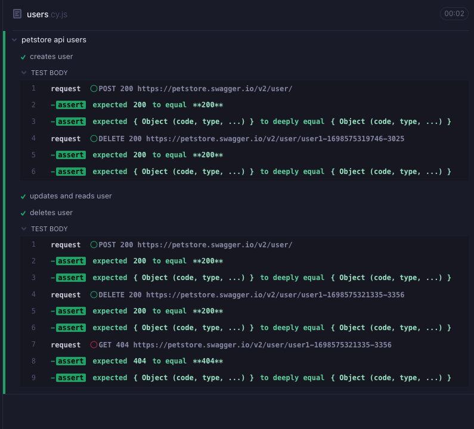

# Cypress API Testing Project

## Описание
Этот проект создан для демонстрации тестирования API с использованием фреймворка Cypress. В проекте реализованы тесты для основных операций CRUD (создание, чтение, обновление и удаление) пользователей на платформе [Petstore](https://petstore.swagger.io/#/).

## Технологии
- [Cypress](https://www.cypress.io/): Фреймворк для автоматического тестирования.
- JavaScript: Язык программирования, используемый для написания тестов.

## Результаты тестирования

## Ссылка на dashboard в cloud.cypress
[cloud.cypress](https://cloud.cypress.io/projects/uumo6a/runs/1/overview?roarHideRunsWithDiffGroupsAndTags=1)
